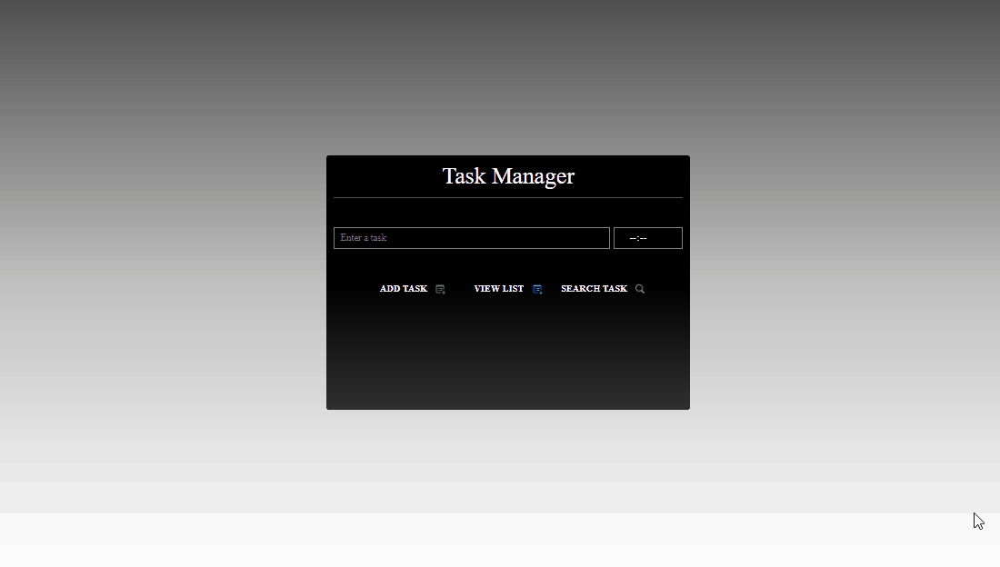
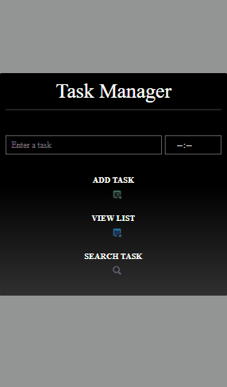

<h1 align='center'>GERENCIADOR DE TAREFAS</h1>
<br>
<h4 align='center' >Aplicação destinada para adicionar de forma permanente, tarefas do dia a dia.</h4>

<br>
<br>

<p align='center'>
    &nbsp
    &nbsp
    
</p>

<br>
<br>


<div align='center' >
    <h1>Desktop</h1>
    
</div>

<br>
<br>

<div align='center'>
    <h1>Mobile</h1>
    
</div>

<br>
<br>

## Tecnologias

<br>
    
**IDE**

- VS code

**Front-End**

- HTML;
- CSS / [SMACSS](http://smacss.com/) (Scalable and Modular Architecture for CSS);
- JavaScript.


## Tecnologias

**IDE**

  - VS Code.

**Front-End**

  - HTML;
  - CSS / [SMACSS](http://smacss.com/) (Scalable and Modular Architecture for CSS);
  - JavaScript.

## Instruções

Há duas formas para poder utilizar a aplicação:

**Clonando através do console**

  - Primeiramente, instale o [Git](https://git-scm.com) em seu computador;

  - Após a instalação, abra o **GitBash** a partir do diretório que receberá o clone;

  - E por fim, digite o seguinte comando:

```bash
$ git clone https://github.com/Eliel504/TaskManager.git
```

**Baixando através do GitHub**

  - Clique na opção "**tag**", próximo as opções "branch" e "master";

  - E então, faça o download da versão mais recente.

## Licença

Este projeto está sob a licença do **MIT**. Acesse o arquivo [LICENSE](https://github.com/Eliel504/TaskManager/blob/master/LICENSE) para obter mais informações.


